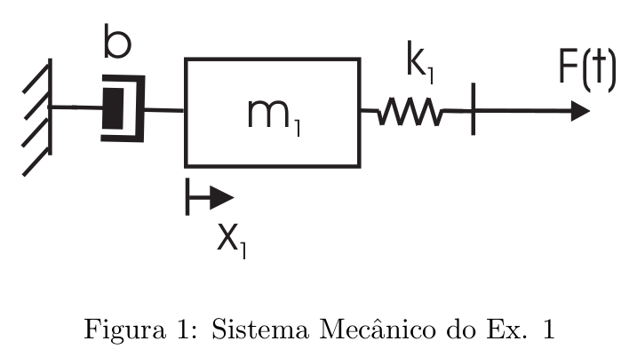
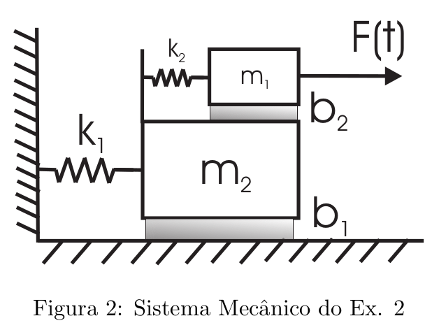
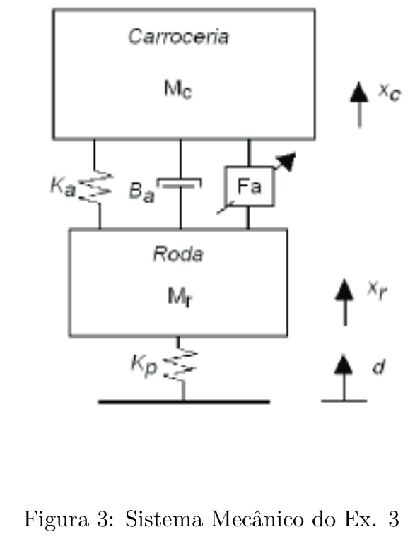
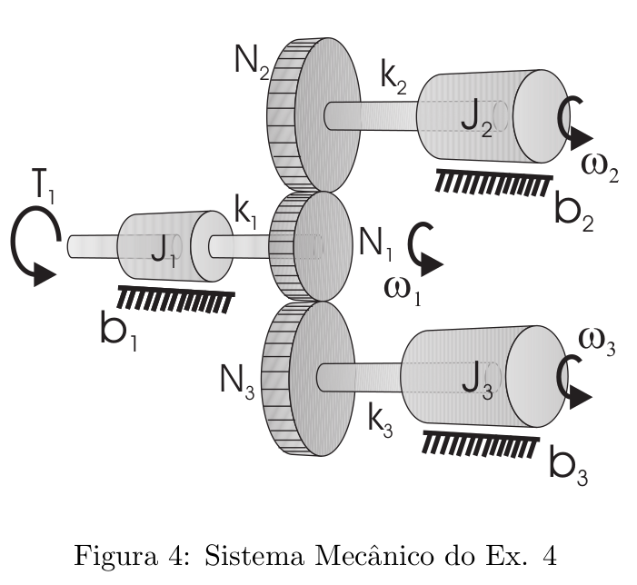
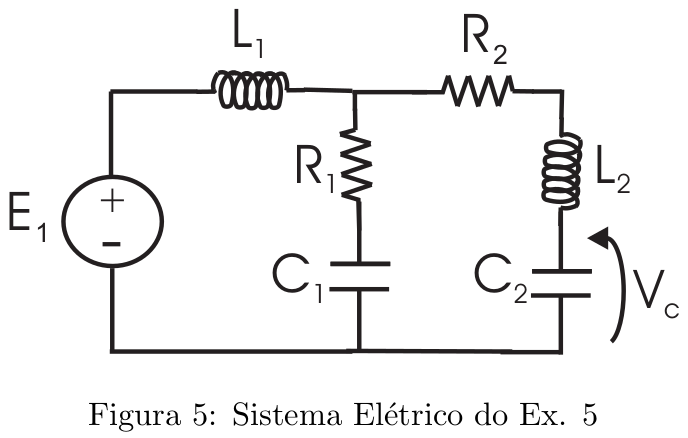
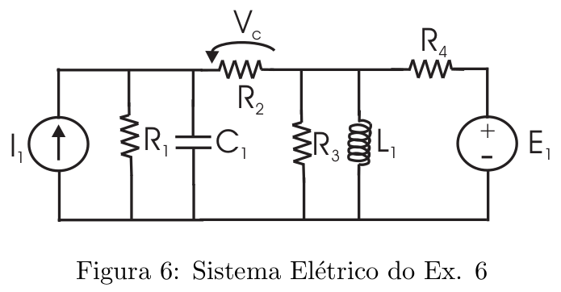
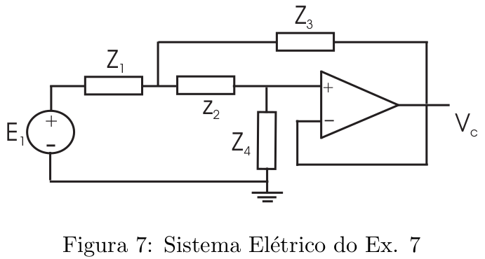
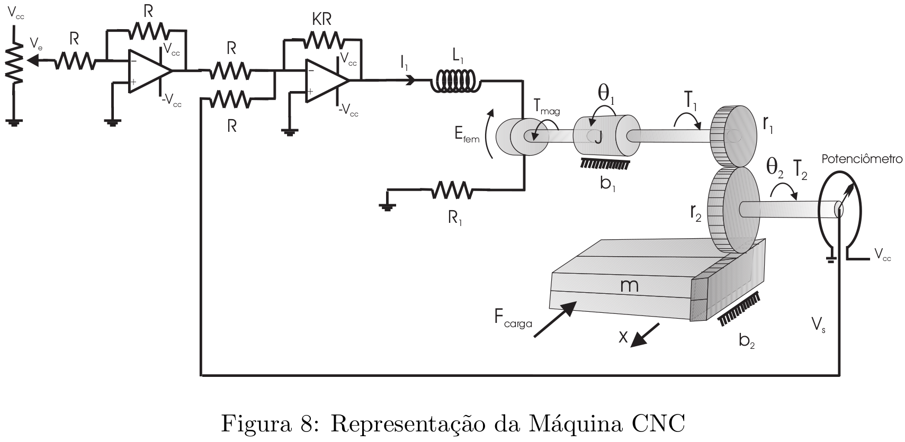

# Lista 1 - Modelagem

## Exercício 1
Para o sistema mecânico translacional apresentado na Figura 1:
1. Encontre o modelo matemático do sistema;
2. Encontre a função de transferência $G(s) = X_1 (s)/F(s)$;
3. Considerando $b = m_1 = 1$, determine a faixa de valores de $k_1$ para o sistema ser oscilatório.

RESOLUÇÃO AQUI

## Exercício 2
Seja o sistema mecânico translacional apresentado na Figura 2. Determine:
1. O modelo matemático do sistema ($x_1$ é a posição do bloco 1, e $x_2$ do bloco 2);
2. Considerando $k_1 = k_2 = m_1 = m_2 = 1 = b_2$ , encontre a faixa de valores de $b_1$ para o sistema ser oscilatório;
3. Considerando os mesmos parâmetros do item anterior e ainda $b_1 = 3$, encontre as respostas $x_1(t)$ e $x_2(t)$ do sistema a um degrau unitário em $F(t)$.

RESOLUÇÃO AQUI

## Exercício 3
O chamado modelo de 1/4 de carro, conforme apresentado na Figura 3, é utilizado para projeto
de sistemas de suspensão ativa em veı́culos automotores. Neste sistema, modelam-se a massa
da roda $M_r$ , da carroceria $M_c$ , o amortecedor $B_a$ , a mola $K_a$ e a elasticidade do pneu $K_p$. $F_a$ representa uma força aplicada pelo próprio atuador do sistema de suspensão ativa. Considere que o peso é completamente equilibrado em $x_r = x_c = d = 0$.

1. Encontre o modelo matemático deste sistema, considerando que as entradas são d (deslocamento da roda, que deve acompanhar rigidamente o solo) e F a (t), e as saı́das são a posição da carroceria $x_c$ e a posição da roda $x_r$.
2. Considerando $M_c = 250$ kg, $M_r = 28,58$ kg, $K_a = 10000$ N/m, $K_p = 155900$ N/m, $B_a = 850$ Ns/m, o sistema é oscilatório?

RESOLUÇÃO AQUI

## Exercício 4
Dado o sistema mecânico rotacional apresentado na Figura 4, determine:
1. O modelo matemático do sistema, onde $T_1$ é um torque motriz (entrada);
2. Determine a função de transferência $\Omega_1(s)/T_1(s)$;

Tem-se que $N_1, N_2, N_3$ são os números de dentes das engrenagens.

RESOLUÇÃO AQUI

## Exercício 5
Seja o sistema elétrico apresentado na figura 5. Determine:

1. O modelo matemático do sistema, considerando a entrada como sendo a fonte $E_1$
2. A função de transferência $V_c(s)/E_1(s)$

RESOLUÇÃO AQUI

## Exercício 6
Dado o circuito elétrico apresentado na figura 6:

1. Determine o modelo matemático considerando que $I_1$ e $E_1$ são as entradas e $V_c$ é a saı́da;
2. Determine a matriz de funções de transferência do sistema, ou seja, as funções de transferência de $I_1$ para $V_c$ (considerando $E_1$ nula) e de $E_1$ para $V_c$ (considerando $I_1$ nula);
3. Considerando que $L_1 = 2$, determine a faixa de valores de $C_1$ para os quais o circuito é
oscilatório
4. Considerando $E_1 = H(t)$ (degrau unitário) e $I_1 \equiv 0$, determine a resposta total do sistema
para tensão inicial no capacitor igual a 1V (e demais condições iniciais nulas).

RESOLUÇÃO AQUI

## Exercício 7
Dado o circuito com amplificador operacional apresentado na figura 7. Determine:

1. Determine a função de transferência $V_c(s)/E_1(s)$ considerando que $Z_1 = R_1$ e $Z_2 = R_2$ são resistores e $Z_3$ e $Z_4$ são capacitores $C_2$ e $C_1$;
2. O que ocorre se os resistores forem trocados pelos capacitores (e vice-versa)?

RESOLUÇÃO AQUI

## Exercício 8
Seja o sistema eletromecânico com realimentação de posição apresentado na figura 8. É acionada uma carga linear de massa $m$ através de um par engrenagem-cremalheira. Ao movimento
da carga linear opõe-se uma força de carga (função do tempo) considerada como sendo uma perturbação.

**Considerando o sistema em malha aberta (desligando o ampop do motor):**

1. Encontre o modelo da parte mecânica deste sistema
2. Encontre o modelo da parte elétrica (considere que a resistência total de cada potenciômetro
é igual a $R$).
3. Encontre a função de transferência entre a tensão na entrada do motor (saı́da do segundo amplificador operacional) e a posição $\theta_2$;

**Considerando o sistema em malha fechada:**
4. Desenhe o diagrama de blocos do sistema completo (em malha fechada)
5. Encontre a função de transferência em malha fechada do sistema, da tensão proporcional à posição desejada $V_e$ à tensão proporcional à posição real $V_s$

RESOLUÇÃO AQUI