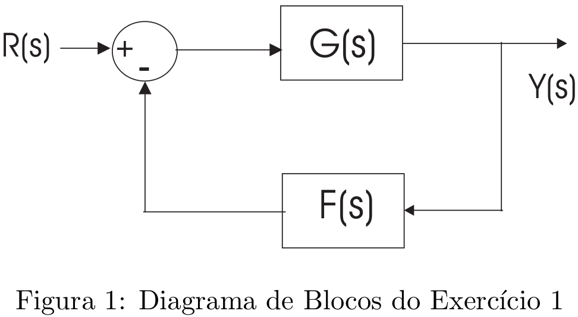

# Lista 2 - Regime Transitório e Critério de Routh

## Exercício 1
Seja o sistema realimentado com diagrama de blocos mostrado na figura 1. Considerando que $G(s)  =\dfrac{K}{s(s+2)}$ e $F(s) = 1 + ks$. Determine:

1. Os valores de K e k tais que o sistema tenha fator de amortecimento $\xi = 0.7$ e frequência natural não-amortecida $\omega_n = 4$ rad/s.
2. Para estes valores de $K$ e $k$, determine a resposta ao degrau unitário, o tempo de subida, o tempo de pico, a porcentagem de sobressinal e o tempo de acomodação a 2%.

A FTMA será $G(s)F(s) = \dfrac{K(1+ks)}{s(s+2)}$. Para averiguarmos o comportamento como sistema de 2ª ordem, calcularemos o valor da FTMF:
$$ FTMF = \dfrac{G(s)}{1+G(s)F(s)} $$
$$\implies FTMF = \dfrac{G(s)}{1+G(s)F(s)} $$

Igualando com sistema de 2° ordem:

## Exercício 2
Seja um sistema de controle em malha fechada com realimentação unitária e tal que $G(s)H(s) = \dfrac{1}{s(s+1)}$. Obter o tempo de subida, o tempo de acomodação, a porcentagem máxima de sobressinal e o erro estacionário para o degrau unitário e a rampa unitária para o sistema em malha fechada.

Resolução aqui

## Exercício 3
Aplicando-se o critério de Estabilidade de Routh-Hurwitz, determine a faixa de valores de K para se ter estabilidade para as seguintes equações caracterı́sticas

1. $s^3 + 3s^2 + 3s + 1 + K = 0$
1. $S^4 + s^3 + Ks^2 + s + 1 = 0$
1. $S^4 + 6s^3 + 11s^2 + 6s + K = 0$

Resolução aqui

## Exercício 4
Seja um sistema de controle em malha fechada com realimentação unitária e $G(s)H(s) = \dfrac{K}{s(s+1)(s+2)}$. Determine a faixa de valores de $K$ para se ter estabilidade em malha fechada.

Sendo realimentação unitária, o denominador da respectiva FTMF de forma expandida será:
$$s(s+1)(s+2) + K$$
$$s(s^2+3s+2)+K$$
$$\implies s^3+3s^2+2s +K$$

Obtendo os coeficientes de cada monômio: $s^3+3s^2+2s + K \implies [1, 3, 2, K]$