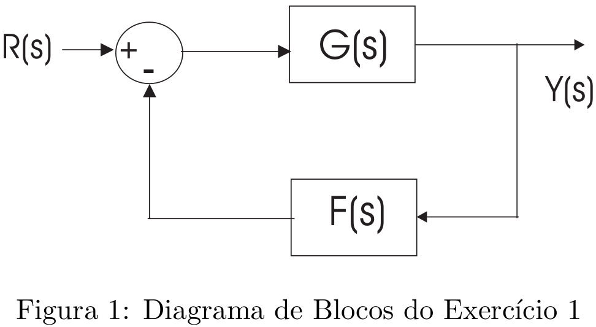

# Lista 2 - Regime Transitório e Critério de Routh

## Exercício 1
Seja o sistema realimentado com diagrama de blocos mostrado na figura 1. Considerando que $G(s)  =\dfrac{K}{s(s+2)}$ e $F(s) = 1 + ks$. Determine:

1. Os valores de $K$ e $k$ tais que o sistema tenha fator de amortecimento $\xi = 0.7$ e frequência natural não-amortecida $\omega_n = 4$ rad/s.
2. Para estes valores de $K$ e $k$, determine a resposta ao degrau unitário, o tempo de subida, o tempo de pico, a porcentagem de sobressinal e o tempo de acomodação a 2%.

### Exercício 1.1

A FTMA será $G(s)F(s) = \dfrac{K(1+ks)}{s(s+2)}$. Para averiguarmos o comportamento como sistema de 2ª ordem, calcularemos o valor da FTMF:

$$
FTMF = \dfrac{G(s)}{1+G(s)F(s)}
$$

$$
FTMF = \dfrac{\dfrac{K}{s(s+2)}}{1+\dfrac{K(1+ks)}{s(s+2)}}
$$

$$
FTMF = \dfrac{K}{s(s+2)+K(1+ks)}
$$

$$
FTMF = \dfrac{K}{s^2+(2+Kk)s+K}
$$

Igualando com sistema de 2° ordem:

$$
\dfrac{\omega_n^2}{s^2 + 2\xi\omega_n s + \omega_n^2} = \dfrac{K}{s^2+(2+Kk)s+K}
$$

Igualando os parâmetros:

$$
\omega_n^2 = K \implies \omega_n = \sqrt{K}
$$

$$
2\xi\omega_n = 2+Kk
$$

Primeiro a frequência natural amortecida e ganho $K$:

$$
K = \omega_n^2 = 16
$$

Depois:
$$
2\xi\omega_n = 2+Kk
$$

$$ 2\cdot 0.7 \cdot 4 = 2+16k $$

$$ k = 3.5$$

### Exercício 1.2

Com os valores de $K$ e $k$, podemos calcular os demais parâmetros do sistema de 2ª ordem:

- a resposta ao degrau unitário

$$
Y(s) = R(s)\cdot\text{FTMF}
$$

$$
Y(s) = \dfrac{1}{s}\cdot\dfrac{K}{s^2+(2+Kk)s+K}
$$

$$
Y(s) = \dfrac{1}{s}\cdot\dfrac{16}{(s^2+58s+16)}
$$

$$
y(t) = \mathcal{L}^{-1}\{ Y(s) \} = ...
$$

- o tempo de subida

$$
...
$$

- o tempo de pico

$$
...
$$

- a porcentagem de sobressinal

$$
M_p = \exp{\left( -\pi\dfrac{\xi}{\sqrt{1-\xi^2}} \right)}
$$

- tempo de acomodação a 2%

$$
t_s(2\%) = \dfrac{4}{\xi\omega_n}
$$

$$
t_s(2\%) = \dfrac{4}{0.7\cdot 4}
$$

$$
t_s(2\%) = \dfrac{10}{7} \approx 1.43 \text{ s}
$$

## Exercício 2
Seja um sistema de controle em malha fechada com realimentação unitária e tal que $G(s)H(s) = \dfrac{1}{s(s+1)}$. Obter o tempo de subida, o tempo de acomodação, a porcentagem máxima de sobressinal e o erro estacionário para o degrau unitário e a rampa unitária para o sistema em malha fechada.

Resolução aqui

## Exercício 3
Aplicando-se o critério de Estabilidade de Routh-Hurwitz, determine a faixa de valores de K para se ter estabilidade para as seguintes equações caracterı́sticas

1. $s^3 + 3s^2 + 3s + 1 + K = 0$
1. $s^4 + s^3 + Ks^2 + s + 1 = 0$
1. $s^4 + 6s^3 + 11s^2 + 6s + K = 0$

### Resolução 3.1

...

### Resolução 3.2

...

### Resolução 3.3

...

## Exercício 4
Seja um sistema de controle em malha fechada com realimentação unitária e $G(s)H(s) = \dfrac{K}{s(s+1)(s+2)}$. Determine a faixa de valores de $K$ para se ter estabilidade em malha fechada.

### Resolução do exercício 4

Sendo realimentação unitária, o denominador da respectiva FTMF de forma expandida será:
$$s(s+1)(s+2) + K$$

$$s(s^2+3s+2)+K$$

$$\implies s^3+3s^2+2s +K$$

Obtendo os coeficientes de cada monômio: $s^3+3s^2+2s + K \implies [1, 3, 2, K]$

INSERIR TABELA DE ROUTH AQUI

Os termos da 1ª coluna serão: [1, 3, $\dfrac{6-K}{3}$, $K$]

Para termos estabilidade todos os termos devem ter mesmo sinal. Dessa forma:

- $(6-K) / 3 > 0 \implies K<6$
- $K>0$

Portanto, a malha fechada será estável para valores de $K$ tais que $0<K<6$.