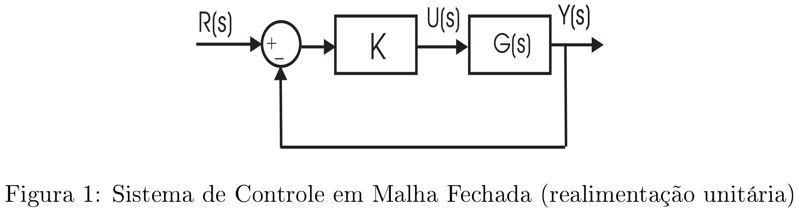
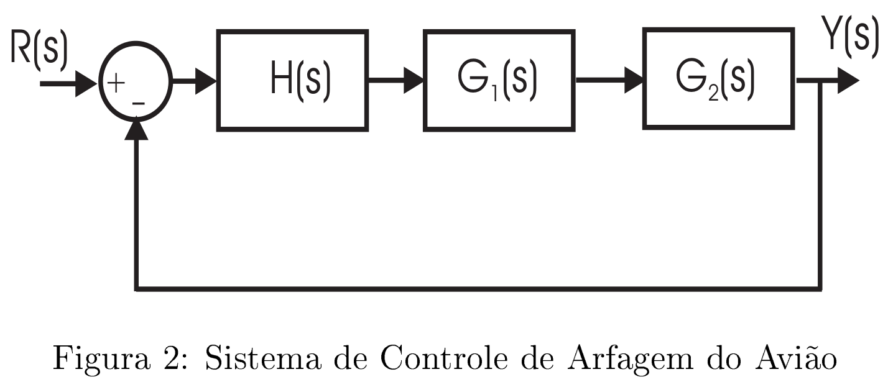

# Lista 3 - LGR

## Exercício 1
Construa o Lugar Geométrico das Raízes (LGR) para as funções de transferência em malha
aberta abaixo ($K$ é o parâmetro variável). Determine também a faixa de valores de $K$ para se ter estabilidade em malha fechada.

- $G(s)H(s) = \dfrac{K}{(s+1)(s+2-j)(s+2+j)}$
- $G(s)H(s) = \dfrac{K(s+2)}{(s+1)(s+3-j)(s+3+j)}$
- $G(s)H(s) = \dfrac{K}{s(s+6)(s+8)}$
- $G(s)H(s) = \dfrac{K(s+1)}{s^2(s+9)}$
- $G(s)H(s) = \dfrac{K(s+1)(s+3)}{s^3}$
- $G(s)H(s) = \dfrac{K(s^2+6s+10)}{s^2+2s+10}$

**Observação:** Aplique todas as regras apresentadas em aula e esboce os grácos, indicando os parâmetros importantes. Todos os passos devem ser apresentados.

## Exercício 2
Utilize agora a função `rlocus` do *MATLAB* para obter os LGRs das funções do problema
anterior. Compare os gráficos obtidos com os do exercício anterior.

...

## Exercício 3
Seja o sistema de controle em malha fechada apresentado na figura 1, onde $G(s) = \dfrac{s-1}{(s+2)(s+2)}$. Esboce o LGR e determine a faixa de valores de $K$ onde se tenha estabilidade em malha fechada

Resolução aqui

## Exercício 4
Um robô industrial possui a seguinte função de transferência entre força na garra $F(s)$ e tensão na armadura do motor CC $V(s)$ que aciona a garra:
$$
G(s) = \dfrac{F(s)}{V(s)} = \dfrac{K(s+2.5)}{(s^2+2s+2)(s^2+4s+5)}
$$

Deseja-se projetar um sistema de controle para a força na garra do tipo proporcional em malha fechada e com realimentação unitária. Pede-se:
1. Esboce o LGR para o sistema em questão
2. Encontre o ganho $K$ que resulta em polos dominantes em malha fechada com coeficientes de amortecimento $\xi = 0.707$
3. Encontre o máximo sobressinal e tempo de pico para o $K$ determinado no item anterior

Resolução aqui

## Exercício 5
O sistema de controle em malha fechada da velocidade de arfagem de um avião é dado na figura 2. As funções de transferência são:

- Controlador: $H(s) = \dfrac{(s+2)^2K_2}{(s+10)(s+100)}$
- Atuador: $G_1(s) = \dfrac{10}{s+10}$
- Dinâmica da aeronave: $G_2(s)=\dfrac{K_1(\tau s+1)}{s^2+2\xi\omega_ns + \omega_n^2}$

onde $\omega_n=2.5$ rad/s, $\xi = 0.30$ , $\tau = 0.1$ , $y(t)$ é a velocidade de arfagem e $r(t)$ é a velocidade de arfagem desejada.

1. Esboce o LGR, supondo que o parâmetro variável é $K_1K_2$.
2. Determine o valor de $K_2$ necessário para ter um fator de amortecimento $0.707$ para os polos dominantes em malha fechada, supondo que $K_1 = 0.02$.

**OBS.:** Use a função `rlocus` do *MATLAB*.

Resolução

## Exercício 6
Seja um sistema de controle em malha fechada (com realimentação unitária) com função de
transferência em malha aberta dada por
$$
G(s)H(s) = \dfrac{K(s+1)(s+3)}{s(s-1)(s+4)(s+8)}
$$

onde $K$ é o parâmetro que se pode variar. Deseja-se selecionar $K$ de modo que a resposta a um degrau unitário de referência seja razoavelmente amortecida e o tempo de acomodação a 2% seja
inferior a $3.0$ segundos.

1. Esboce o LGR e selecione $K$ de modo que os polos dominates de malha fechada possuam
um $\xi$ superior a $0.6$.
2. Encontre analiticamente a reposta ao degrau unitário para o sistema em malha fechada com
o valor de $K$ selecionado.

Resolução

## Exercício 7
Para as funções de transferência em malha aberta abaixo:
1. $G(s)H(s) = \dfrac{4(s^2+1)}{s(s+a)}$
1. $G(s)H(s) = \dfrac{10}{s(s+1)(s+a)}$

esboçar o LGR considerando que o parâmetro variável é $a>0$.

Resolução