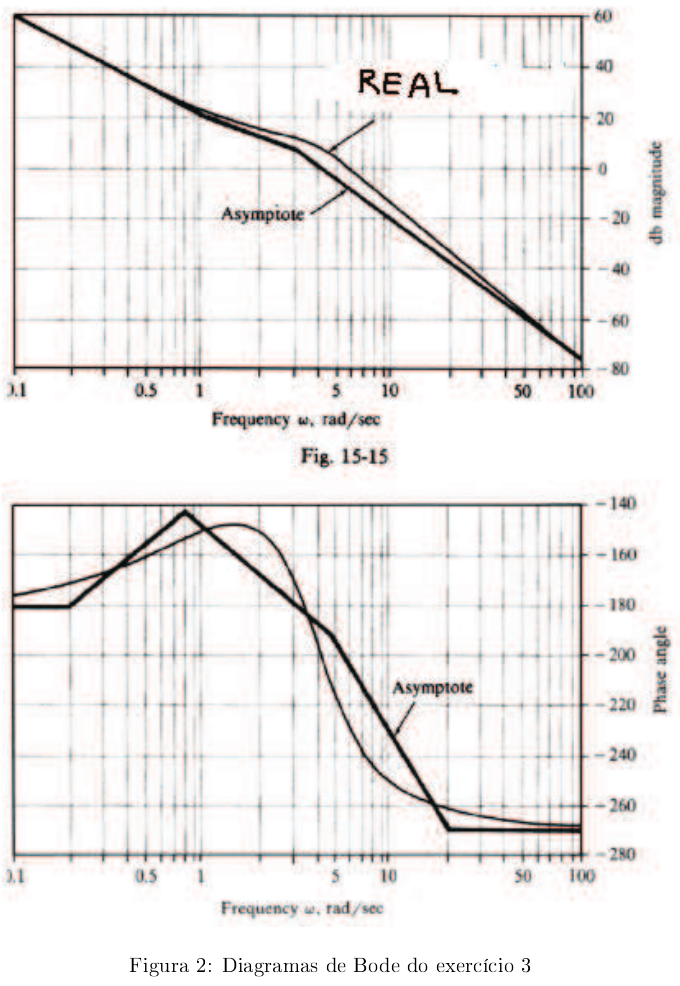

# Lista 5 - Resposta em frequência 1

## Exercício 1
Esboce os diagramas de Bode de módulo e fase (assíntotas e aproximações) para as seguintes
funções de transferência (detalhe todos os passos). Se for conveniente, utilize papel monolog.

1. $G(j\omega) = 1$
2. $G(j\omega) = 1$
3. $G(s) = \dfrac{2(s+2)}{s^2-1}$
4. $G(s) = 1$
5. $G(s) = 1$

Resolução aqui

## Exercício 2
Um amplificador passa-faixas pode ser representado pelo circuito da figura 1. Considerando que $R_1 = R_2 = 1.0k\Omega$ , $C_1 = 100pF$ , $C_2 = 1.0\mu F$ e $K = 100$ , mostre que a função de transferência
$E_0/E_1$ é dada por:
$$ G(s) = \dfrac{10^9s}{(s+1000)(s+10^7)} $$

1. Esboce os diagramas de Bode de $G(j\omega)$
2. Encontre o ganho em frequências médias em dB.
3. Determine as frequências para o ganho de $-3dB$ .

Resolução aqui

## Exercício 3
Na figura 2 tem-se um diagrama de Bode para um sistema $G(s)$.

1. Descubra se o sistema é de fase mínima ou não.
2. Encontre a função de transferência propriamente dita.

Resolução aqui

## Exercício 4
Na figura 3 tem-se um diagrama de Bode para um sistema $G(s)$. Sabe-se que este sistema é instável. Encontre a função de transferência correspondente.

Resolução aqui

## Exercício 5
Um sistema mola-massa-amortecedor, como mostrado na figura 4, foi submetido a um ensaio de
resposta em frequência, onde foram levantados os diagramas de Bode apresentados nas figuras 5.
Determine os valores numéricos de $K$, $M$ e $B$ baseando-se nestes diagramas de Bode.

Resolução aqui

## Exercício 6
Considere o sistema de controle com realimentação unitária cuja função de transferência em malha aberta é
$$
G(s)H(s) = \dfrac{K}{s(s^2+s+4)}
$$

Determine o valor de ganho $K$ de modo que a margem de fase seja igual a 50°. Qual é a margem de ganho para esse caso?

Resolução aqui
