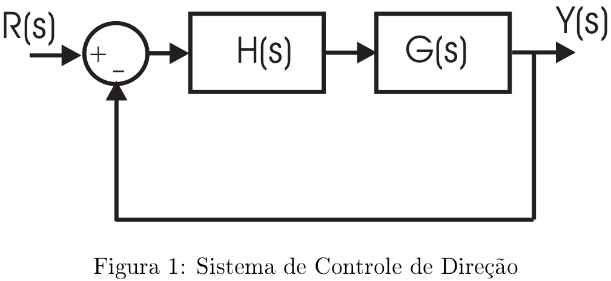

# Lista 6 - Resposta em frequência 2

## Exercício 1
...

Resolução

## Exercício 2
...

Resolução

## Exercício 3
...

Resolução

## Exercício 4
...

Resolução

## Exercício 5
A eletrônica e os computadores têm sido usados para controlar automóveis. Na figura 1, tem-se um sistema de controle de direção, onde $H(s) = e^{-sT}$, $G(s) = \dfrac{K}{s(0.1s+1)}$ e $T=0.2$ segundo.

1. Determine um valor de $K$ tal que a resposta em frequência em malha fechada apresente um pico de ressonância menor ou igual a $2$ dB.
2. Estime o valor de $\xi$.
3. Determine a banda-passante do sistema em malha fechada.

Resolução