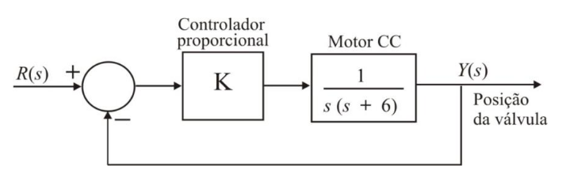

# P1 - 2020 (PTC3020)

Arquivo PDF: [link](./p1_ptc3020_2020.pdf)

## Questão 1 **(Valor: 1,5)**
...

## Questão 2 **(Valor: 1,5)**
Alguns carros utilizam um sistema de suspensão ativa para proporcionar viagens confortáveis e firmes. O projeto de um sistema de suspensão ativa ajusta a posição das válvulas do amortecedor de modo a estabelecer as condições de conforto para a viagem. O ajuste é feito por meio de um motor CC de acordo com as condições da pista. O diagrama de blocos do sistema é apresentado na figura a seguir.

Supondo que o ganho do controlador proporcional seja $K=8$, pede-se:

a) Determine a resposta transitória temporal da saída de posição $y(t)$, quando é aplicado um degrau unitário na referência. **(Valor: 1,5)**

a) Resposta temporal

Chamando a planta de $G(s) = \dfrac{1}{s(s+6)}$ e $H(s)\equiv 1$ (realimentação unitária), temos que:
$$
FTMA = KG(s)H(s) = \dfrac{K}{s(s+6)}
$$
Dado que temos realimentação unitária, nossa FTMF será:
$$
FTMF = \dfrac{K}{s(s+6) + K} = \dfrac{K}{s^2+6s+K}
$$

Portanto:
$$
FTMF = \dfrac{Y(s)}{R(s)} = \dfrac{K}{s^2+6s+K}
$$

Isso é suficiente para calcularmos $y(t) = \mathcal{L}^{-1}[Y(s)]$ para entrada degrau unitário, i.e., $R(s) = 1/s$:
$$
Y(s) = R(s)\cdot \dfrac{K}{s^2+6s+K}
$$
$$\implies
Y(s) = \dfrac{1}{s}\cdot \dfrac{8}{(s^2+6s+8)}
$$
Fatorando:
$$
Y(s) = \dfrac{8}{s(s+2)(s+4)}
$$
Fazendo frações parciais:
$$
Y(s) = 8\cdot\left[ \dfrac{1/8}{s} - \dfrac{1/4}{s+2} + \dfrac{1/8}{s+4} \right]
$$
$$
Y(s) = \dfrac{1}{s} - \dfrac{2}{s+2} + \dfrac{1}{s+4}
$$

Portanto:
$$\therefore
y(t) = 1 - 2e^{-2t} + e^{-4t}, \forall t>0
$$

## Questão 3 **(Valor: 1,5)**
...

## Questão 4 **(Valor: 1,5)**
...