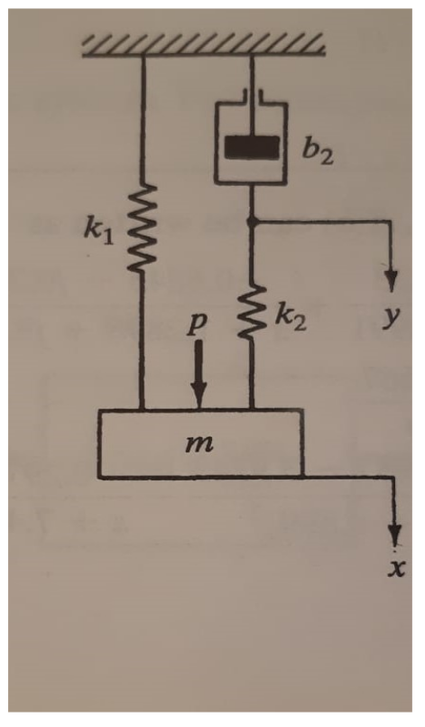
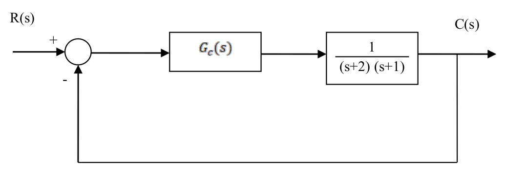
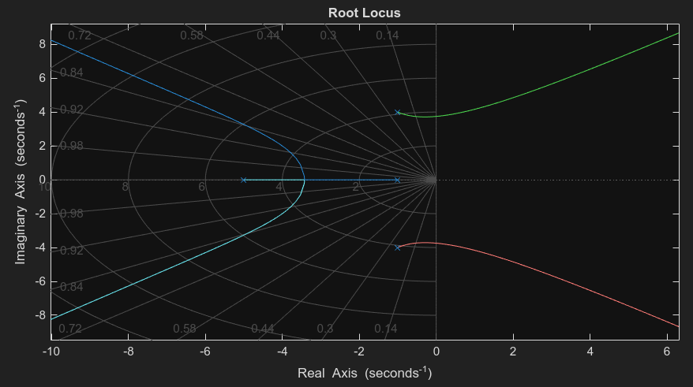

# P1 - 2021 (PTC3020)

Arquivo PDF: [link](./p1_ptc3020_2021.pdf)

## Questão 1 **(Valor: 2,0)**

A figura a seguir apresenta um sistema mecânico. O sistema está inicialmente em repouso. Os deslocamentos $x$ e $y$ são medidos a partir de suas respectivas posições de equilíbrio. Assumindo que $p(t)$ seja a entrada (força tipo degrau) e que o deslocamento $x(t)$ seja a saída, obtenha a função de transferência do sistema.

<p align="center">
    
</p>

Podemos modelar as seguintes forças:
- Forças elásticas
    - $k_1\cdot y(t)$
    - $k_2\cdot y(t)$
- Forças de amortecimento
    - $b_2\cdot y'(t)$
- Força de entrada: $p(t)$
<!-- - Força peso
    - $m\cdot g$ -->


Pela 2ª lei de Newton, a soma vetorial total forma a força resultante, tal que:
$$
F_R(t) = m\cdot a(t)
$$

Dado que a aceleração é a derivada de segunda ordem do deslocamento, temos:

$$
m\cdot \dfrac{d^2}{dt^2}x(t) = (k_1 + k_2)\cdot y(t) + b_2\cdot y'(t) + p(t)
$$

Aplicando a transformada de Laplace a condições iniciais nulas:

$$
m\cdot s^2X(s) = (k_1 + k_2)\cdot Y(s) + b_2\cdot sY(s) + P(s)
$$

Tomando $p(t)$ como entrada e $x(t), y(t)$ como saída:
$$
m\cdot s^2X(s) = Y(s)\cdot(k_1 + k_2 + sb_2) + P(s)
$$

$$
\therefore m\cdot s^2X(s) - Y(s)\cdot(k_1 + k_2 + sb_2) = P(s)
$$

## Questão 2 **(Valor: 2,5)**
Considere o sistema da seguinte figura.

<p align="center">
    
</p>

Considerando $G_c(s) = 1$, pede-se:

a) A ordem e o tipo do sistema? **(Valor: 0,5)**

b) A frequência natural não amortecida, o coeficiente de amortecimento, o sobressinal e o tempo de acomodação (2%) do sistema em malha fechada? **(Valor: 1,0)**

c) É possível projetar um controlador proporcional, i.e., $G_c(s) = k$, tal que o tempo de acomodação (2%) do sistema em malha fechada seja $t_s(2\%) \approx 1s$ e o sobressinal máximo seja $1,52\%$? Justifique utilizando o Lugar das Raízes. **(Valor: 1,0)**

**Minha solução:**

a)
$$ FTMA = G_c(s)G(s)H(s) = 1\cdot \dfrac{1}{(s+2)(s+1)}\cdot 1 $$
$$ \therefore FTMA = G_c(s)G(s)H(s) = \dfrac{1}{(s+2)(s+1)} $$

Calculei a FTMA para que possamos visualizar sua forma e notar que no denominador não há um termo $s^N$, de forma que temos, enfim, $N=0$. Logo, o sistema é tipo 0.

Agora, como o denominador é formado pelo produto de 2 polinômios de 1º grau, temos um polinômio de 2º grau. Isso denota um sistema de 2ª ordem.

**Resposta: Tipo 0, ordem 2**

b) ...

c) ...

## Questão 3 **(Valor: 5,5)**

Um engenheiro quer projetar um sistema de controle proporcional $K$ ($K>0$) em malha fechada, com realimentação unitária, para a planta
$$
G(s) = \dfrac{1}{(s+1)(s+5)(s^2+2s+17)}
$$

Pede-se:

a) Determine o valor do erro estacionário ao degrau unitário para este sistema. **(Valor 0,5)**

b) Determine, utilizando o critério de Routh-Hurwitz, para que valores de $K$ o sistema é estável. **(Valor 1,0)**

c) Esboce o Lugar Geométrico das Raízes indicando claramente os pontos de início e término do LGR, o LGR sobre o eixo real, os ângulos das assíntotas, intersecção das assíntotas com o eixo real, os pontos de partida e chegada do eixo real (indicando o ganho associado), os ângulos de partida dos polos complexos e, se houver, os pontos de cruzamento com o eixo imaginário (ganho e frequência). **(Valor 3,0)**

d) Determine o valor de $K$ tal que dois polos de malha fechada se situem em $-0,482 \pm 3,73j$ **(Valor 1,0)**

**Minha solução:**

a) O erro num diagrama de blocos é definido por:

$$ E(s) = R(s) - C(s)H(s) $$
$$ E(s) = R(s) - E(s)\cdot G_c(s)G(s)\cdot H(s) $$
$$ E(s) (1+G_c(s)G(s)\cdot H(s))= R(s)$$
$$ E(s) = \dfrac{R(s)}{1+G_c(s)G(s)H(s)}$$

Aplicando os valores de realimentação unitária e entrada degrau unitário ($R(s) = 1/s$)
$$ E(s) = \dfrac{1/s}{1+KG(s)}$$

Para calcular o erro estacionário, i.e., o valor da função temporal do erro no tempo tendendo a infinito, vamos aplicar o TVF:
$$
\lim_{t\to\infty}e(t) = e(\infty) = \lim_{s\to 0}sE(s)
$$

$$ e(\infty) = \lim_{s\to 0}s\cdot\dfrac{1/s}{1+KG(s)} $$
$$ e(\infty) = \lim_{s\to 0}\dfrac{1}{1+KG(s)} $$
$$ e(\infty) = \dfrac{1}{1+K\lim_{s\to 0}G(s)} $$
$$ e(\infty) = \dfrac{1}{1+K\dfrac{1}{(0+1)(0+5)(0^2+2\cdot0 + 17)}} $$
$$ e(\infty) = \dfrac{1}{1+\dfrac{K}{85}}$$
$$ \therefore e(\infty) = \dfrac{85}{85 + K} $$

b) Vamos calcular a FTMA e FTMF

$$
FTMA = G_c(s)G(s)H(s) = \dfrac{K}{(s+1)(s+5)(s^2+2s+17)}
$$

Sendo realimentação unitária, para calcular a FTMF apenas somamos $K$ ao denominador:
$$
FTMF = \dfrac{K}{(s+1)(s+5)(s^2+2s+17) + K}
$$

Expandindo o denominador da FTMF e chamando-o de $A(s)$, temos:
$$ A(s) = (s+1)(s+5)(s^2+2s+17) + K $$
$$ A(s) = (s^2+6s+5)(s^2+2s+17) + K $$
$$ ... $$

Organizamos o $A(s)$ em coeficientes do $s^4$ até o $s^0$ numa tabela própria e calculamos todos os termos. Assim, teremos uma primeira coluna onde para termos uma FTMF estável, não deverá haver troca de sinal. Daí fazemos o conjunto de inequações [desenvolver aqui]

c) Regras de traçado do LGR

1. Saiba quais e quantos são os zeros e polos de MA

A FTMA de forma fatorada é:
$$
G(s) = \dfrac{1}{(s+1)(s+5)(s+1-4j)(s+1+4j)}
$$

Zeros: nenhum $(m=0)$

Polos: ${-1;-5;-1\pm 4j}$ $(n=4)$

Um LGR possui:
- $n-m$ ramos
- $n-m-1$ assíntotas

2. Coloque no plano complexo esses pontos e simbolize o zero de MA por um círculo e o polo de MA por um X

3. LGR sobre o eixo real

Para saber quais pontos do eixo real (pontos com parte imag. nula) pertencem ao LGR, faça o seguinte: Todos os pontos do eixo real que possuem um número ímpar de polos+zeros a sua direita, pertencem ao LGR

4. Cálculo dos ângulos das assíntotas

O LGR sempre segue a regra que tem seu começo nos polos e seu término nos zeros,i.e., tem uma seta com um sentido da onde ela sai de um polo e vai a um zero. No caso desta planta onde não há zeros, o LGR começa num polo e vai a um zero no infinito e pode seguir diversas curvas. Essas curvas sempre são limitadas por assíntotas, i.e., retas de suporte que ditam o fluxo do LGR.

Elas fazem um ângulo com o eixo real tal que:
$$
\alpha_i = \dfrac{180° + 360°i}{n-m}, i = 0, ..., n-m-1
$$
Neste caso, aplicaremos $i$ de $0$ até $n-m-1 = 3$:
$$ \alpha_0 = \dfrac{180° + 360°\cdot 0}{3} = 60° $$
$$ \alpha_1 = \dfrac{180° + 360°\cdot 1}{3} = 180° $$
$$ \alpha_2 = \dfrac{180° + 360°\cdot 2}{3} = 300°\equiv -60° $$
$$ \alpha_3 = \dfrac{180° + 360°\cdot 3}{3} = 390°\equiv 60° $$

Calculamos 3 ângulos: $\{60°; -60°; 180°\}$

Mas onde essas assíntotas se encontram?

5. Ponto de cruzamento das assíntotas

Ocorre em:
$$s_0 = \dfrac{\sum \text{polos} - \sum \text{zeros}}{n-m}$$
$$s_0 = \dfrac{(-1-5-1+4j-1-4j) - (0)}{4-0}$$
$$s_0 = \dfrac{-8}{4} = -2$$

<p align="center">
    
</p>

6. Ponto de chegada e partida do LGR sobre o eixo real

[CONTINUA...]

De curiosidade fica o código MATLAB que gerou esse gráfico
```matlab
% Planta G(s)
% Definição por polos e zeros
zerosG = [];
polosG = [-1 -5 -1+4j -1-4j];
G = zpk(zerosG, polosG, 1); % planta
H = 1; % realimentação unitária

FTMA = G*H;
FTMF = feedback(G,H);

rlocus(FTMA) % comando para gerar o LGR

```

d) Condição de módulo do LGR

$$ |KG(s)| = 1 = \dfrac{|K|}{|s+1|\cdot|s+5|\cdot|s^2+2s+17|} $$
Ou ainda:
$$ |K| = |s+1|\cdot|s+5|\cdot|s^2+2s+17| $$

Substituindo $s_1 = -0,482 + 3,73j$ e $s_2 = s_1^*$ (o valor do ganho em módulo será o mesmo):
$$
|K| = |s_1+1|\cdot|s_1+5|\cdot|s_1^2+2s_1+17|
$$
$$
\therefore |K| = 99.8472
$$
