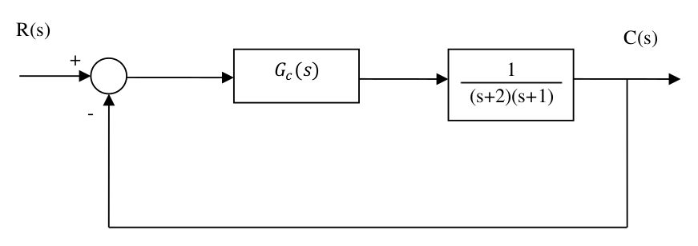

# P1 - 2020 (PTC3313)

Arquivo PDF: [link](./p1_ptc3313_2020.pdf)

## Questão 1 **(Valor: 1,0)**

Num motor CC foi aplicado um degrau unitário de tensão nos terminais da sua entrada $u(t)$. A velocidade de saída $y(t)$ foi medida por meio de um tacogerador, cujo gráfico está representado na figura a seguir.

Supondo que o gráfico acima represente a saída $y(t)$ (em Volts) em função de $t$(em s) de um sistema de primeira ordem, determine a função de transferência do motor CC.

O sistema de 1ª ordem pode ser expresso pela seguinte função de transferência:

$$
G(s) = \dfrac{A}{1+sT} = \dfrac{Y(s)}{U(s)}
$$

ou no domínio do tempo: $y(t) = A(1 - e^{-t/T}), t\geq0$

Onde $T$ é a constante de tempo e $A$ é a amplitude. Para calcular a amplitude $A$ podemos usar o próprio gráfico.

$$
A = \lim_{t\to \infty} y(t) = 8
$$

Para calcular $T$ aplicamos na fórmula da saída no domínio do tempo:

$$ y(T) = A(1 - e^{-T/T}) $$
$$ y(T) = A(1 - e^{-1}) $$
$$ y(T) \approx 0,6321A \implies y(T) \approx 5$$

Pelo gráfico, o valor corresponde para $y(T) \approx 5$ é $t = 4$. Logo, $T = 4$.

Com esses valores calculados, temos nossa resposta:

$$ G(s) = \dfrac{8}{1 + 4s} $$

## Questão 2 **(Valor: 5,5)**

Um engenheiro quer projetar um sistema de controle proporcional $K$($K>0$) em malha
fechada com realimentação unitária para a planta

$$
G(s) = \dfrac{1}{(s+1)(s+5)(s^2+2s+17)}
$$

Pede-se:

a) Determine o valor do erro estacionário ao degrau unitário para este sistema. **(Valor 0,5)**

b) Determine, utilizando o critério de Routh-Hurwitz, para que valores de 𝐾 o
sistema é estável. **(Valor 1,0)**

c) Esboce o Lugar Geométrico das Raízes indicando claramente os pontos de início e término do LGR , o LGR sobre o eixo real, os ângulos das assíntotas, intersecção das assíntotas com o eixo real, os pontos de partida e chegada do eixo real (indicando o ganho associado), os ângulos de partida dos polos complexos e, se houver, os pontos de cruzamento com o eixo imaginário (ganho e frequência). **(Valor 3,0)**

d) Determine o valor de 𝐾 tal que dois polos de malha fechada se situem em $−0.482 \pm 3.73j$. **(Valor 1,0)**

a) Cálculo do erro estacionário para entrada degrau unitário ($R(s) = 1/s$)

$$
E(s) = \dfrac{R(s)}{1+G_c(s)G(s)H(s)}
$$

$$
E(s) = \dfrac{1/s}{1+KG(s)}
$$

Pelo TVF:

$$
e(\infty)=\lim_{t\to\infty}e(t) = \lim_{s\to0}sE(s)
$$

$$
e(\infty) = \lim_{s\to0}s\dfrac{1/s}{1+KG(s)}
$$

$$
e(\infty) = \lim_{s\to0}\dfrac{1}{1+KG(s)}
$$

$$
e(\infty) = \dfrac{1}{1+K\lim_{s\to0}G(s)}
$$

$$
e(\infty) = \dfrac{1}{1+K\dfrac{1}{1\cdot5\cdot17}}
$$

$$\therefore
e(\infty) = \dfrac{85}{85+K}
$$

b) ...

c) ...

d) ...

## Questão 3 **(Valor: 3,5)**

Considere o sistema da seguinte figura.

Considerando $G_c(s) = 1$, pede-se:

a) A ordem e o tipo do sistema? **(Valor: 0,5)**

b) A frequência natural não amortecida, o coeficiente de amortecimento, o sobressinal e o tempo de acomodação ($2\%$) do sistema em malha fechada? **(Valor: 0,5)**

c) É possível projetar um controlador proporcional, i.e., $G_c(s) = k$, tal que o tempo de acomodação ($2\%$)
 do sistema em malha fechada seja $t_s(2\%) 
 \approx 1.0s$ e o sobressinal máximo seja 1.52%? 
 Justifique utilizando o Lugar das Raízes.
**(Valor: 1,0)**

d) Deseja-se agora empregar o seguinte compensador

$$
G_c(s) = k_c\dfrac{(s+z_c)}{(s+p_c)}
$$

Projete o mesmo de forma a cancelar o polo mais rápido da planta e garantir as mesmas especificações do item c). Justifique utilizando o Lugar das Raízes.
**(Valor: 1,5)**

a) Ordem e tipo do sistema

A função de transferência precisa estar na forma canônica, i.e., com os polinômios do numerador e denominador fatorados em polinômios do primeiro grau. Nesse caso, temos:

$$
G(s) = \dfrac{1}{(s+2)(s+1)}
$$

Como não há no denominador nenhum termo do tipo $s^N$ isolado, temos que o tipo $N$ do nosso sistema é zero.

Já a ordem do sistema é o grau do polinômio completo do denominador. Como o denominador é um produto de 2 polinômios do 1º grau, temos, portanto, um polinômio do 2º grau. Isso caracteriza um sistema de 2ª ordem.

**Resposta:** Tipo 0 e ordem 2

b) Frequência natural não amortecida, coeficiente de amortecimento, sobressinal e tempo de acomodação ($2\%$) 
do sistema em malha fechada

Vamos primeiro calcular a FTMF.

$$ FTMA = G_c(s)G(s)H(s) $$
Como $G_c(s) = H(s)\equiv 1$, então:
$$ FTMA = \dfrac{1}{(s+2)(s+1)} $$

Para a FTMF, sendo realimentação unitária, apenas somamos o numerador ao denominador. Ou você pode optar por usar a definição de FTMF.

$$
FTMF = \dfrac{G(s)}{1 + G(s)H(s)}
$$

$$
FTMF = \dfrac{1}{(s+2)(s+1) + 1}
$$

$$
\therefore FTMF = \dfrac{1}{s^2 +3s +3}
$$

Como estamos lidando com um sistema de 2ª ordem, para calcular os parâmetros pedidos, precisamos comparar com a seguinte fórmula:

$$
FTMF = \dfrac{1}{s^2 +3s +3} = \dfrac{\omega_n^2}{s^2 + 2\xi\omega_n s + \omega_n^2}
$$

Onde $\omega_n$ é a frequência natural não amortecida e $\xi$ é o coeficiente de amortecimento.

Podemos multiplicar e dividir por $3$ para igualar a fórmula (ignore o 1/3 na comparação dos valores).

$$
FTMF = \dfrac{1}{3}\left(\dfrac{3}{s^2 +3s +3}\right)= \dfrac{\omega_n^2}{s^2 + 2\xi\omega_n s + \omega_n^2}
$$

Assim, temos:
$$
\omega_n^2 = 3
$$

$$
2\xi\omega_n = 3
$$

Logo:
$$
\omega_n = \sqrt{3}\text{ rad/s}
$$

$$
\xi = \dfrac{3}{2\omega_n} \implies \xi = \dfrac{\sqrt{3}}{2}\approx 0,866
$$

Os demais valores possuem fórmula:
- Sobressinal:
$$M_p = \exp{\left(\dfrac{-\pi \xi}{\sqrt{1 - \xi^2}}\right)} = 0,433\%$$
- Tempo de acomodação a 2\% ($t_s(2\%)$):$$t_s(2\%) = \dfrac{3}{\xi\omega_n} = 2s$$

c) Reajuste com compensador de ganho $k$

Se temos $G_c(s) = k$, teremos as seguintes funções de transferência de malha aberta e fechada:

$$
FTMA = G_c(s)G(s)H(s) = k\cdot\dfrac{1}{(s+2)(s+1)}\cdot 1
$$

$$
\therefore FTMA = \dfrac{k}{(s+2)(s+1)}
$$

$$
FTMF = \dfrac{k}{(s+2)(s+1) + k} = \dfrac{k}{s^2+3s+2 + k}
$$

Os valores novos de tempo de acomodação e sobressinal são:

$$
t_s(2\%) = \dfrac{3}{\xi\omega_n} = 1
$$

$$
M_p = \exp{\left(\dfrac{-\pi \xi}{\sqrt{1 - \xi^2}}\right)} = 1,52\%
$$

Como o sobressinal depende só do $\xi$, então fazemos os cálculos:

$$
\exp{\left(\dfrac{-\pi \xi}{\sqrt{1 - \xi^2}}\right)} = 1,52\%
$$

<!-- $$ {\dfrac{-\pi \xi}{\sqrt{1 - \xi^2}}} = \ln(1,52/100) $$
$$ {\dfrac{\xi}{\sqrt{1 - \xi^2}}} = \dfrac{\ln(0,0152)}{-\pi} $$ -->

$$
\therefore\xi = 0,6397
$$

Pelo tempo de acomodação: $\omega_n = 3/\xi \implies \omega_n = 4,6894 \text{rad/s}$

Portanto, o sistema de 2ª ordem reajustado é:

$$
FTMF' = \dfrac{22}{s^2 + 6s + 22}
$$

Considerando realimentação unitária, sua FTMA respectiva é $FTMA' = \dfrac{22}{s^2+6s}$. Portanto possui em MA:
- Zeros: nenhum (0 zeros)
- Polos: $\{0;-6\}$ (2 polos)

Como temos uma diferença no termo 3s e 6s, não é possível dimensionar esse compensador para esses novos requisitos do sistema de 2ª ordem.

[Fazer o LGR]

d) Compensador com zero e polo

Teremos a seguite FTMA:

$$
FTMA = k_c\dfrac{(s+z_c)}{(s+p_c)}\cdot \dfrac{1}{(s+2)(s+1)}
$$

$$
\therefore FTMA = \dfrac{k_c(s+z_c)}{(s+2)(s+1)(s+p_c)}
$$

Possui:
- Zeros: $-z_c$ (1 zero)
- Polos: $\{-2;-1;-p_c\}$ (3 polos)

Pelo projeto, devemos cancelar o polo mais rápido da planta. No plano complexo estamos lidando com valores de frequência, portanto quanto mais longe da origem maior a frequência (menor tempo). Logo, devemos cancelar o polo mais distante da origem, i.e., o polo -2. Dessa forma, teremos $z_c=2$ e a seguinte FTMA:

$$
FTMA = \dfrac{k_c}{(s+1)(s+p_c)}
$$

Considerando agora esses 2 polos restantes: temos o seguinte LGR:
[desenhar e inserir aqui]

