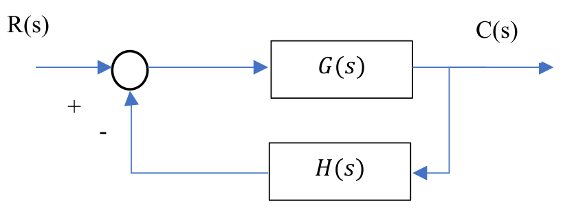
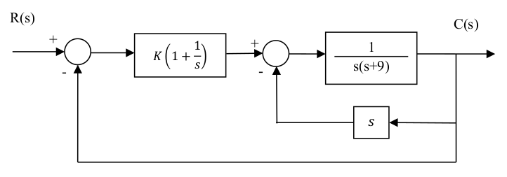

# P1 - 2021 (PTC3313)

Arquivo PDF: [link](./p1_ptc3313_2021.pdf)

## Questão 1 **(Valor: 1,5)**
Um engenheiro realizou um ensaio e obteve a seguinte função de transferência de um
determinado processo
$$ G(s) = \dfrac{197,14}{(s+6,9)(s+10)(s+20)} $$

Posteriormente, colocou um controlador $G_c (s) = (s + 7)$ em série com a planta e afirmou que a resposta do sistema a uma entrada tipo degrau unitário poderia ser aproximada por uma resposta equivalente de um sistema de 2ª ordem. Pede-se:

a) Calcule a resposta temporal do sistema para a entrada mencionada. **(Valor 0,75)**

b) A afirmação é verdadeira? Justifique. **(Valor 0,75)**

a) Resposta temporal.

O sistema no domínio da frequência é:
$$
G_c(s)G(s) = \dfrac{197,14(s+7)}{(s+6,9)(s+10)(s+20)}
$$

Realizando a transformada de Laplace inversa e usando frações parciais:
$$
\mathcal{L}^{-1}[G_c(s)G(s)] = 197,14\cdot\mathcal{L}^{-1}\left[
\dfrac{(s+7)}{(s+6,9)(s+10)(s+20)}\right]
$$
$$
\mathcal{L}^{-1}[G_c(s)G(s)] = 197,14\cdot\mathcal{L}^{-1}\left[
\dfrac{A_1}{s+6,9} + \dfrac{A_2}{s+10} + \dfrac{A_3}{s+20}
\right]
$$
$$A_1 = \dfrac{7-6,9}{(10-6,9)(20-6,9)} = \dfrac{0,1}{3,1\cdot13,1} = 0,002462 $$
$$A_2 = \dfrac{7-10}{(6,9 - 10)(20-10)} = \dfrac{-3}{(-3,1)\cdot10} = 0,0967$$
$$A_3 = \dfrac{7-20}{(6,9-20)(10-20)} = \dfrac{-13}{(-13,1)(-10)} = -0,099 $$

$$
\mathcal{L}^{-1}[G_c(s)G(s)] = 197,14\cdot\mathcal{L}^{-1}\left[
\dfrac{0,002462}{s+6,9} + \dfrac{0,0967}{s+10} - \dfrac{0,099}{s+20}
\right] $$

$$
\mathcal{L}^{-1}[G_c(s)G(s)] = 197,14\cdot\left[
0,002462e^{-6,9t} + 0,0967e^{-10t} - 0,099{-20t}
\right],t>0
$$

b) Sobre a afirmação

Como o termo $A_1$ é desprezível, podemos aproximar para:
$$
\mathcal{L}^{-1}[G_c(s)G(s)] \approx 197,14\cdot\mathcal{L}^{-1}\left[ \dfrac{0,0967}{s+10} - \dfrac{0,099}{s+20} \right]
$$

A partir dessa aproximação, notamos que o uso de um compensador em série funcionou de forma a cancelar o polo em $-6,9$ já que ele possuìa um zero em $s = -7$.

## Questão 2 **(Valor: 1,0)**
Considere o sistema da figura abaixo:

onde $G(s) = \dfrac{1}{s^4+s^2+1}$ e $H(s) = Ks^3 + s$

Determine, utilizando o Critério de Routh, para que valores de $K$ o sistema em malha fechada é estável **(Valor 1,0)**

Calculando a FTMF:

$$ FTMF = \dfrac{G(s)}{1+G(s)H(s)} $$
$$ FTMF = \dfrac{\dfrac{1}{s^4+s^2+1}}{1+\dfrac{Ks^3 + s}{s^4+s^2+1}} $$
$$ FTMF = \dfrac{1}{s^4+Ks^3+s^2+s+1} $$

Para aplicar p critério, vamos usar todos os coeficientes do polinômio do denominador da FTMF na tabela:

$A(s) = 1s^4+Ks^3+1s^2+1s+1$

| $s^4$ | 1       | 1     | 1     | 0 |
|-------|---------|-------|-------|---|
| $s^3$ | $K$     | 1     | 0     | 0 |
| $s^2$ | $b_1$   | $b_2$ | $b_3$ | 0 |
| $s^1$ | $c_1$   | $c_2$ | $c_3$ | 0 |
| $1$   | $d_1$   | $d_2$ | $d_3$ | 0 |
$$ b_1 = \dfrac{-(1\cdot 1 - K\cdot 1)}{K} = \dfrac{K-1}{K}$$
$$ b_2 = \dfrac{-(1\cdot 0 - K\cdot 1)}{K} = 1$$
$$ b_3 = \dfrac{-(1\cdot 0 - K\cdot 0)}{K} = 0$$
$$ c_1 = \dfrac{-(b_2\cdot K - b_1\cdot 1)}{b_1} = 1-\dfrac{K^2}{K-1}$$
$$ c_2 = \dfrac{-(b_3\cdot K - b_1\cdot 0)}{b_1} = 0 = c_3$$
$$ d_1 = \dfrac{-(b_1c_2 - b_2c_1)}{c_1} = \dfrac{-(b_1\cdot 0 - 1c_1)}{c_1} = \dfrac{c_1}{c_1} = 1$$
$$d_2 = \dfrac{-(b_1c_3 - b_3c_1)}{c_1} = 0 $$

Logo, a tabela fica:
| $s^4$ | $1$       | $1$     | $1$     | $0$ |
|-------|---------|-------|-------|---|
| $s^3$ | $K$     | $1$     | $0$     | $0$ |
| $s^2$ | $\dfrac{K-1}{K}$   | $1$ | $0$ | $0$ |
| $s^1$ | $1-\dfrac{K^2}{K-1}$   | $0$ | $0$ | 0 |
| $1$   | $1$   | $0$ | $0$ | 0 |

Pelo critério, vamos analisar a primeira coluna de valores à esquerda. Para um sistema em malha fechada ser estável, não deve haver trocas de sinal. Logo:
- $$\dfrac{K-1}{K} > 0$$
$$K-1>0\implies K>1$$
- $$ 1-\dfrac{K^2}{K-1}>0 $$
$$\dfrac{K^2}{K-1}< 1$$
$$K^2<K-1$$
$$K^2-K+1<0$$
Essa segunda condição, apresenta valores complexos de $K$.

Portanto, com essas duas condições que não podem ser simultaneamente satisfeitas, temos que não há valores reais de $K$ tais que a malha fechada seja estável

## Questão 3 **(Valor: 3,5)**
Considere o sistema da seguinte figura.

a) Encontre a função de transferência em malha fechada C(s)/R(s) **(Valor: 0,75)**
b) Encontre os valores de K para se ter estabilidade em malha fechada. **(Valor: 0,75)**
c) Qual o erro estacionário à rampa unitária? **(Valor 0,5)**
d) Considerando $K=1$, justifique se as fórmulas referentes ao máximo sobressinal e o tempo de pico para sistemas de segunda ordem podem ser aplicadas, e, em caso afirmativo, utilize-as para encontrar esses valores para R(s)=1/s. **(Valor 1,5)**

## Questão 4 **(Valor: 4,0)**
...

