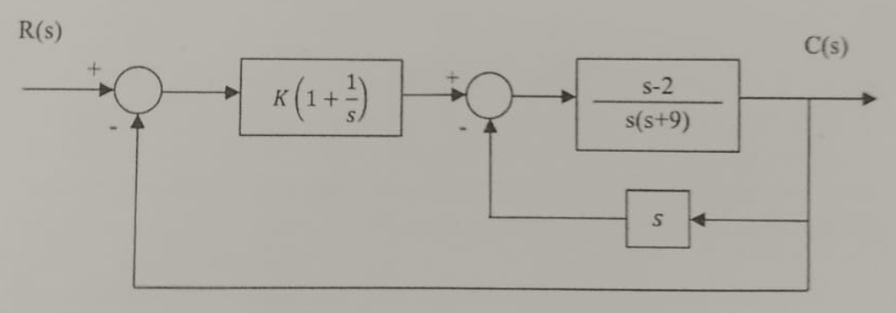
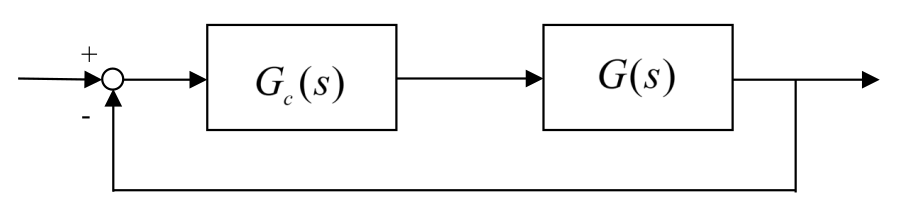
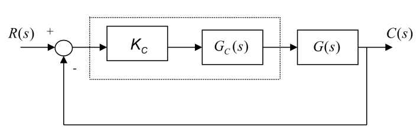

# P1 - 2025 (PTC3313)

Arquivo PDF: SEM PDF AINDA
<!-- [link](./p1_ptc3313_2025.pdf) -->

## Questão 1 **(Valor: 3,5)**

Considere o sistema da figura abaixo:

Pede-se:

a) Encontre a função de transferência em malha fechada $C(s)/R(s)$ **(Valor 1,0)**

b) Determine os valores de $K>0$ para se ter estabilidade em malha fechada **(Valor 1,5)**

c) Esboce o LGR para $K>0$ (aplique somente as regras de esboço que fazem sentido). É possível confirmar o resultado do item b? **(Valor 1,0)**

a) Cálculo da FTMF

Chamarei $G_1(s) = K\left( 1 + \dfrac{1}{s} \right)$, $G_2(s) = \dfrac{s-2}{s(s+9)}$ . Temos uma malha fechada entre a planta $G_2(s)$ e a realimentação $H_1(s) = s$ , tal que:

$$
FTMF1 = \dfrac{G_2(s)}{1+G_2(s)\cdot s}
$$

$$
\therefore FTMF1 = \dfrac{0,5(s-2)}{s(s+3,5)}
$$

Essa função de transferência está em série com $G_1(s)$, formando a planta:

$$
G_3(s) = FTMF1\cdot G_1(s)
$$

$$
G_3(s) = \dfrac{0,5(s-2)}{s(s+3,5)}\cdot K\left( 1 + \dfrac{1}{s} \right)
$$

$$
\therefore G_3(s) = \dfrac{K(s-2)(s+1)}{2s^2(s+3,5)}
$$

Como esta nova planta está em malha fechada com realimentação unitária, temos que a FT que desejamos calcular vale:

$$
FTMF = \dfrac{K(s-2)(s+1)}{2s^2(s+3,5) + K(s-2)(s+1)}
$$

$$
\therefore \dfrac{C(s)}{R(s)} = FTMF = \dfrac{K(s-2)(s+1)}{2s^3 + (K-7)s^2 - Ks - 2K}
$$

b) Estabilidade em MF

Para determinarmos estabilidade em malha fechada, vamos aplicar o critério de Routh sobre o polinômio do denominador da nossa FTMF:

$$
\dfrac{K(s-2)(s+1)}{2s^3 + (K-7)s^2 - Ks - 2K}
$$

Polinômio: $A(s) = 2s^3 + (K-7)s^2 - Ks - 2K$

Construindo a tabela do critério de Routh:

...

c) ...

## Questão 2 **(Valor: 4,0)**

Considere a figura a seguinte

    

onde

$$
G(s) = \dfrac{1}{(s+1)(s+2)(s+12)}
$$

Pretende-se projetar o controlador a partir das seguintes especificações de desempenho:

- Sobressinal máximo: 20%
- Tempo de acomodação (5%): 1s

a) Considere $G_c(s)=K$ e esboce o LGR do sistema indicando claramente os pontos de início e término do LGR, o LGR sobre o eixo real, os ângulos das assíntotas, a intersecção das assíntotas com o eixo real, os pontos de partida e chegada do eixo real e, se houver, os pontos de cruzamento com o eixo imaginário (ganho e frequência). **(Valor 1,5)**

b) A partir de agora considere $G_c(s) = K(s+a)$. Determine os polos do sistema desejado a partir das especificações de desempenho admitindo que a resposta dominante seja de 2ª ordem. **(Valor 1,0)**

c) Determine, usando o Método do Lugar das Raízes (a partir das condições de módulo e fase), os parâmetros $K$ e $a$ do controlador proposto. **(Valor 1,5)**

**Minha solução:**

a) LGR

Temos a seguinte FTMA:

$$
FTMA = G_c(s)G(s) = \dfrac{K}{(s+1)(s+2)(s+12)}
$$

Notamos que:
- Zeros de MA: nenhum ($m=0$)
- Polos de MA: {$-1;-2;-12$} ($n=3$)

Portanto, teremos um LGR com:
- $n-m=3$ ramos
- $n-m-1=2$ assíntotas

Próximo passo é calcular os ângulos das assíntotas:

$$
\alpha_i = \dfrac{180°+360°i}{n-m} \text{, onde }i=0,...,n-m-1=2
$$

Os ângulos são:
$$
\alpha_0 = \dfrac{180°+360°\cdot0}{3} = 60°
$$

$$
\alpha_1 = \dfrac{180°+360°\cdot1}{3} = 180°
$$

$$
\alpha_2 = \dfrac{180°+360°\cdot2}{3} = 300°\equiv -60°
$$

O ponto de cruzamento das assíntotas no eixo real:

$$
s_0 = \dfrac{\sum \text{polos} - \sum \text{zeros}}{n-m}
$$

$$
s_0 = \dfrac{(-1-2-12) - 0}{3} \implies s_0 = -5
$$

b) ...

c) ...

## Questão 3 **(Valor: 2,5)**

Considere o sistema da figura abaixo.

    

onde $G_c(s)=1$, $G(s) = \dfrac{1}{(s+p)(s+4)}$ e $K_c>0$

A partir da resposta ao degrau unitário apresentada na figura seguinte, pede-se:

    <!--  -->
    GRÁFICO AQUI

a) Os valores de $K_c$ e $p$. **(Valor 2,0)**

b) O valor do erro estacionário do sistema para uma entrada do tipo degrau unitário. **(Valor 0,5)**

**Minha solução:**

a) Valores dos parâmetros

Calculemos a FTMA:

$$
FTMA = K_cG_c(s)G(s) = \dfrac{K_c}{(s+p)(s+4)}
$$

Calculemos a FTMF:

$$
FTMF = \dfrac{K_c}{(s+p)(s+4) + K_c}
$$

$$
FTMF = \dfrac{K_c}{s^2 + (p+4)s + (4p + K_c)}
$$

O gráfico apresentado para a resposta temporal a entrada degrau unitário já diz pra gente que estamos lidando com um sistema de 2ª ordem. Portanto, precisamos comparar nossa FTMF com o seguinte formato conhecido:

$$
FTMF = \dfrac{\omega_n^2}{s^2 + 2\xi\omega_n s + \omega_n^2}
$$

Para descobrir os parâmetros $\xi$ e $\omega_n$, vemos pelo gráfico que temos já descrito o sobressinal:

$$
M_p = \dfrac{c(t_p) - c(\infty)}{c(\infty)} = \dfrac{0.122}{0.75}
$$

Logo, $M_p = 0.16266$ ou $16.26$ %

O sobressinal também pode ser calculado pela seguinte fórmula:

$$
M_p = \exp\left(\dfrac{-\pi\xi}{\sqrt{1-\xi^2}}\right)
$$

Logo:

$$
\exp\left(\dfrac{-\pi\xi}{\sqrt{1-\xi^2}}\right) = 0.16266
\implies \xi = 0.5
$$

b) Erro estacionário

Fórmula do erro estacionário:

$$
E(s) = \dfrac{R(s)}{1 + K_cG_c(s)G(s)}
$$

O erro estacionário é o valor da função temporal do erro quando o tempo tende a infinito. Para calculá-lo, portanto, usaremos o TVF:

$$
e(\infty) = \lim_{t\to\infty}e(t) = \lim_{s\to0}sE(s)
$$

$$
e(\infty) = \lim_{s\to0}s\cdot \dfrac{R(s)}{1 + K_cG_c(s)G(s)}
$$

Sabendo que a entrada é degrau unitário ($R(s) = 1/s$):

$$
e(\infty) = \lim_{s\to0}s\cdot \dfrac{1/s}{1 + \dfrac{K_c}{(s+p)(s+4)}}
$$

$$
e(\infty) = \lim_{s\to0}\dfrac{1}{1 + \dfrac{K_c}{(s+p)(s+4)}}
$$

$$
e(\infty) = \dfrac{1}{1 + \dfrac{K_c}{4p}}
$$

ou

$$
e(\infty) = \dfrac{4p}{4p + K_c}
$$

